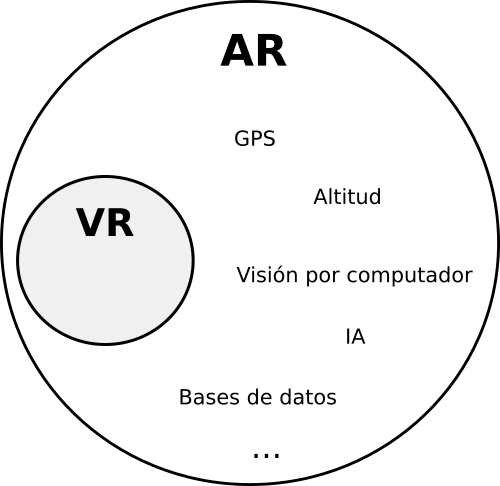
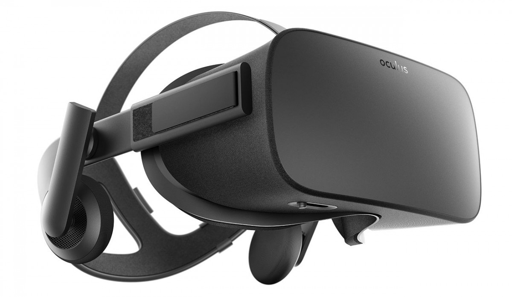

# Una introducción a la Realidad Virtual

Diego F. Goberna | [@feiss](http://twitter.com/feiss) | [feiss.be](http://feiss.be)

<!-- NOTES -->
Charla = breve introducción a VR
Situación / posibilidades a hoy en día

------

# Qué es la Realidad Virtual?

<!-- NOTES -->
- Preguntar cuántos probaron la VR.
- Plataforma HW+SW que permite simular la presencia física del usuario en un entorno "virtual" o distinto al real.
- Cambiará cómo jugamos, trabajamos y nos comunicamos. 

---

# VR vs AR

------

# Elementos

---

## Pantalla(s)

- 2 pantallas/imágenes alta resolución
- Mínimo 90 fps
- Persistencia píxel < 3ms
- Baja latencia input-output

---

## Sensores y Tracking 

- Cabeza | Manos | otros
- Outside-In / Inside-out
- Giroscopio | Acelerómetro | Cámara | LED | Láser

---

------

# Dispositivos

---

## Cardboard y similares

  

    
  

  

    <ul>
      <li>Casco de cartón* donde metes el teléfono</li>
      <li>3DOF</li>
      <li>Fijar la mirada</li>
    </ul>
  

---

## Gear VR / Daydream

  

    
    
  

  

    <ul>
      <li>Cascos de plástico donde metes el teléfono</li>
      <li>3DOF</li>
      <li>Mandos 3DOF</li>
    </ul>
  

---

## Playstation VR / OSVR / Oculus / HTC Vive

  

    
    
    
  

  

    <ul>
      <li>Cascos con pantallas incorporadas</li>
      <li>6DOF (Room Scale)</li>
      <li>Mandos 6DOF</li>
      <li>Tracking outside-in</li>
    </ul>
  

---

## iPhone - iPad / Hololens

  

    
    
  

  

    <ul>
      <li>AR</li>
      <li>6DOF ( > Room Scale)</li>
      <li>Tracking inside-out</li>
    </ul>
  

---

------

# Desarrollo VR

---

## Nativo (OpenGL / DirectX)

- Unity / Unreal / CryEngine / libGDX  / otros / a pinrel

<!-- NOTES -->
Ventajas: 
- Rendimiento
- Buenas herramientas

Desventajas:
- Distribución y versionado
- Iteración y prototipado

---

## Web (WebGL + WebVR)

- Three.js &rarr; A-Frame, ReactVR 
- Babylon.js
- Blend4Web

<!-- NOTES -->

Ventajas:
- Rápida iteración y prototipado
- Fácil e inmediata distribución y versionado
- API Javascript

Desventajas: 
- Rendimiento
- Sin pipeline (mejorando)

---

## Tips

- Todo es 3D (X veces más esfuerzo que 2D)
- Es más fácil hacer los objetos "creíbles"
- Para evitar "mareos":
    - No muevas la cámara ni el escenario (teleport)
    - 90 FPS sin saltos
- Campo abierto para la experimentación
    - Nuevas narrativas
    - Nuevos modelos de UX

------

# Aplicaciones prácticas

<!-- NOTES -->
Entretenimiento y Arte
- Juegos
- Películas
- Conciertos y eventos
- Exposiciones

Medicina y psicología 
- Tratamiento de fobias
- Estudio del comportamiento
- Cambios de perspectiva
- Estudios y control de la percepción
- Tratamiento del dolor

Productividad 
- Office, outlook, etc.

Publicidad

Divulgación y enseñanza
- Centros educativos
- Museos
- Lugares de interés

Simuladores de tareas
- Oficios
- Destrezas

Comunicación
- Chats y videoconferencias
- Redes sociales (Metaverso)
- Trabajo a distancia

------

# Consideraciones

- Malestar físico
- Privacidad
- Problemas sociales y éticos

------

# Enlaces

- Mozilla VR: [mozvr.com](http://mozvr.com)
- Google VR: [vr.google.com](http://vr.google.com)
- WebVR: [webvr.info](http://webvr.info) y [webvr.rocks](http://webvr.rocks)
- Noticias: [realovirtual.com](http://realovirtual.com), [uploadvr.com](http://uploadvr.com), [roadtovr.com](http://roadtovr.com)

------

## Gracias! :)

### ¿preguntas?